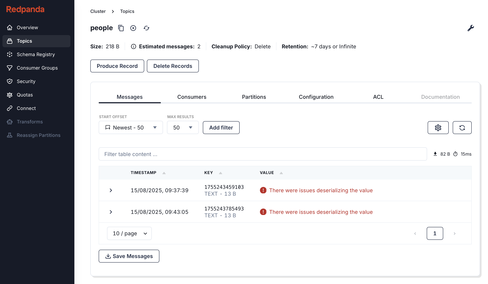
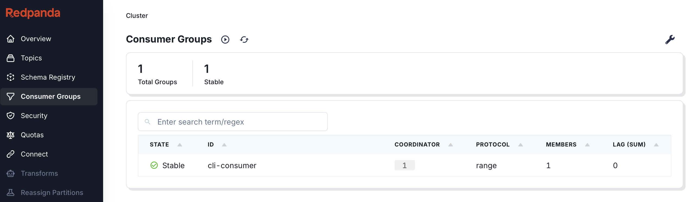

# JSON to Kafka CLI Tool

A CLI utility to send JSON documents as Protobuf messages to a Kafka broker and consume them back as JSON.

## Features

- Convert JSON documents into Protobuf messages and send them to Kafka.
- Consume Protobuf messages from Kafka and print them as JSON.

## Requirements

This project was developed with:

- Java 21
- Docker & Docker Compose
- Gradle Wrapper (included in the repo)

## Running Kafka with Docker

For convenience, there is a `docker-compose.yml` file that spins up a Kafka broker and a Zookeeper instance, as well as
Redpanda, a web-based Kafka UI tool.

The mentioned `docker-compose.yml` file references environment variables that are expected to be read from a `.env`
file.
You can rename or copy the `.env.example` file to `.env` and adjust values as needed, although you probably won't need to.

```bash
cp .env.example .env
```

```bash
docker compose up -d
```

## Building the CLI Tool

Use the gradle wrapper to create a jar file as follows:

```bash
./gradlew fatJar
```

## Running the CLI Tool

Display the main help:

```bash
java -jar build/libs/json-to-kafka-cli-1.0-SNAPSHOT-all.jar --help
```

This will list available commands:

- `send` – send a JSON file as a Protobuf message
- `consume` – consume Protobuf messages and print them as JSON

## Sending a Message

Example JSON (`person.json`):

```json
{
  "name": "Andrés",
  "id": 12345,
  "email": "andres@dev.com"
}
```

Send it to Kafka, for example, to topic `people`:

```bash
java -jar build/libs/json-to-kafka-cli-1.0-SNAPSHOT-all.jar send ./person.json -t people
```

You should see something like this:

```
09:37:39.620 - Message with key 1755243459103 sent to topic: people
```

You can also send another message to a different topic by specifying the `-t` option:

```bash
java -jar build/libs/json-to-kafka-cli-1.0-SNAPSHOT-all.jar send ./person.json -t another-topic
```

## Consuming Messages

Consume messages from topic `people` and print them as JSON:

```bash
java -jar build/libs/json-to-kafka-cli-1.0-SNAPSHOT-all.jar consume -t people
```

You should see something like this:

```
09:40:16.129 - Listening to topic for 1200 seconds: people
09:40:20.182 - Message consumed:

{
  "name": "Andrés",
  "id": 12345,
  "email": "andres@dev.com"
}
```

> Note: If you send more messages while consuming, they will be printed as they arrive.

### Consuming Messages with a Specific Consumer Group

You can also consume messages with a specific consumer group by using the `-g` option, even in combination with the `-o`
option to specify the offset policy:

```bash
java -jar build/libs/json-to-kafka-cli-1.0-SNAPSHOT-all.jar consume -t people -g my-consumer-group -o latest
```

> Note: Using a different consumer group allows you to consume messages independently from other consumers, which is
  useful for testing or debugging purposes. Also, specifying the offset policy allows you to control where to start consuming.

## Displaying topics, messages and consumer groups in Redpanda

You can see some more information on the [Redpanda Console](http://localhost:8088/overview).

As of now, there is no configuration to properly deserialize Protobuf messages, but you can see the items under Topics >
people > Messages.



> Note: As an improvement, I might investigate further on how to configure the Redpanda Console to properly deserialize
> Protobuf messages.

Under Consumer Groups, you can see the consumer group that is consuming messages from the `people` topic.



## Optional: Install as a Standalone Command

You can run the tool without `java -jar` by installing it on your system:

```bash
./gradlew installDist
```

Then run:

```bash
./build/install/json-to-kafka-cli/bin/json-to-kafka-cli --help
```

You can also move the script in `build/install/json-to-kafka-cli/bin/json2kafka` to a directory in your `PATH`.

## References

- [Protobuf Gradle Plugin](https://github.com/google/protobuf-gradle-plugin)
- [Picocli](https://picocli.info/) – command-line parsing
- [Redpanda Console](https://github.com/redpanda-data/console)
